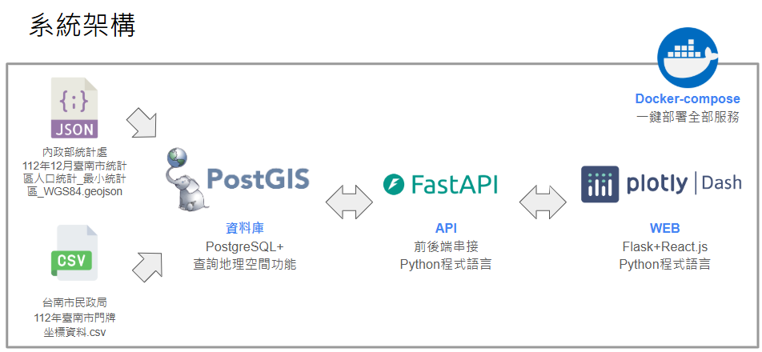

# 2024台南黑客松-災害影響評估平台

## 專案說明

* 本專案為2024年AI台南數位城市治理黑客松競賽成果，題目為水利局災害影響評估平台
* 主要為開發**地圖範圍資訊標記工具**，協助使用者可以在地圖上標記多邊形範圍，自動計算該範圍的面積、戶數與人口數
* 競賽資訊: [2024年AI台南數位城市治理黑客松官方網站](https://aithon2024.goodideas-studio.com/)
* [專案成果簡報連結](./slide/2024台南黑客松-水利局災害影響評估平台專案成果簡報.pdf)

## 專案成果影片

* 請點擊以下圖片至YouTube觀看:
[](https://www.youtube.com/watch?v=uOd5cYxc7uE)

## 專案部署流程
* Step1. 在專案目錄底下執行此程式碼，建立.env檔案，裡面包含資料庫的密碼:
```
echo POSTGRES_PASSWORD=admin >> .env
```

* Step2. 執行Docker-compose指令部署專案:
```
docker-compose up -d
```
* Step3. 部署完成後，在本機端連線至此網址: `http://127.0.0.1:8888/` 即可開始使用

## 系統架構說明



* Python
    * 使用Python 3.11版本
    * 安裝套件清單請參考`requirements.txt`
    * 部署FastAPI、匯入初始資料與Python Dash網站使用
* PostGIS
    * 以Docker建立PostGIS服務
    * [PostGIS Docker官方頁面](https://registry.hub.docker.com/r/postgis/postgis/)
    * Image使用`postgis/postgis:17-3.5`
    * 連線方式:
        * host: 127.0.0.1
        * database: postgres
        * user: postgres
        * password: admin
        * port: 5432
    * 資料表:
        * households: 112年臺南市門牌坐標資料，資料來源: [台南市政府資料開放平台](https://data.tainan.gov.tw/dataset/108-address-location)
        * population: 112年12月臺南市統計區人口統計_最小統計區_WGS84，資料來源: [內政部社會經濟資料服務平台](https://segis.moi.gov.tw/STATCloud/QueryInterfaceView?COL=%252f%252f4qvzChTyZdi2iuwCoAOA%253d%253d&MCOL=ODxgDwr%252fCgWo%252fl0OH5x%252bEQ%253d%253d)
* FastAPI
    * 程式碼請參考: [/api/app.py](/api/app.py)
    * 提供給WEB使用，目前設計6個API接口:
        * /households/point: 計算指定點半徑範圍內的家戶數 
            * 輸入: 指定點經緯度、半徑(公尺)
            * 輸出: 家戶數
        * /population/point: 計算指定點半徑範圍內的人口數
            * 輸入: 指定點經緯度、半徑(公尺)、與最小區域重疊範圍比率
            * 輸出: 人口數
        * /area/point: 計算指定點半徑範圍內的面積
            * 輸入: 指定點經緯度、半徑(公尺)
            * 輸出: 面積(平方公尺)
        * /households/polygon: 計算指定多邊形範圍內的家戶數
            * 輸入: 多邊形經緯度
            * 輸出: 家戶數
        * /population/polygon: 計算指定多邊形範圍內的人口數
            * 輸入: 多邊形經緯度、與最小區域重疊範圍比率
            * 輸出: 人口數
        * /area/polygon: 計算指定多邊形範圍內面積
            * 輸入: 多邊形經緯度
            * 輸出: 面積(平方公尺)
        * 備註:
            * 多邊形經緯度格式範例: POLYGON((120.1828 22.9961, 120.1811 22.9869, 120.1906 22.9926, 120.1828 22.9961))
            * 與最小區域重疊範圍比率: 介於0至1之間
    * FastAPI詳細使用說明與測試頁面，請在本機端部署程式後連入此頁面: `http://127.0.0.1:8000/docs#/`
* WEB
    * 以Python Dash框架撰寫，程式碼請參考: [/web/app.py](/web/app.py)

